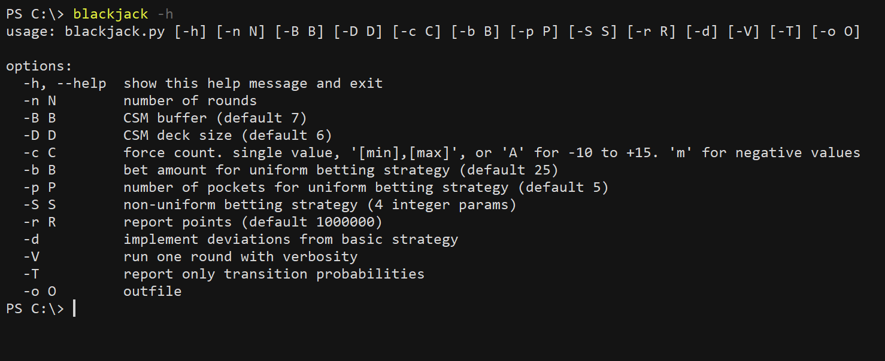
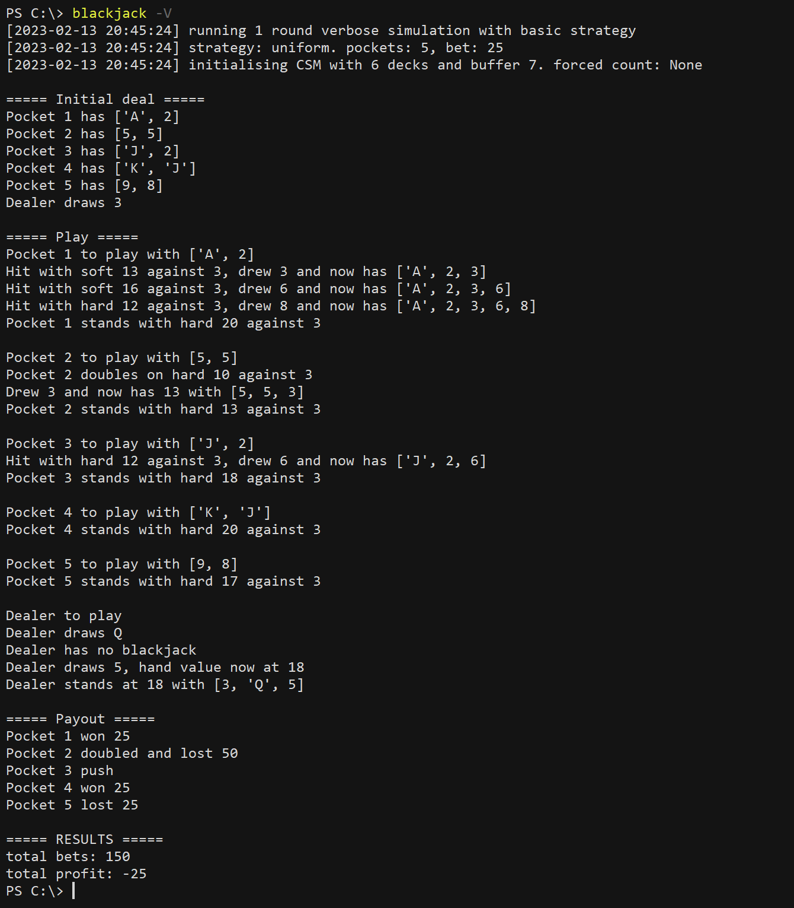
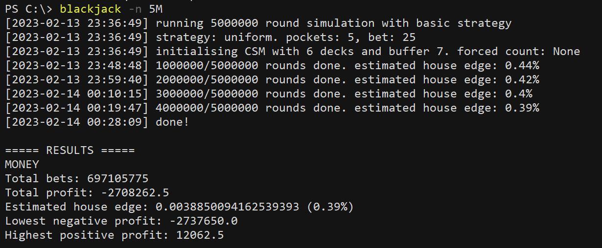
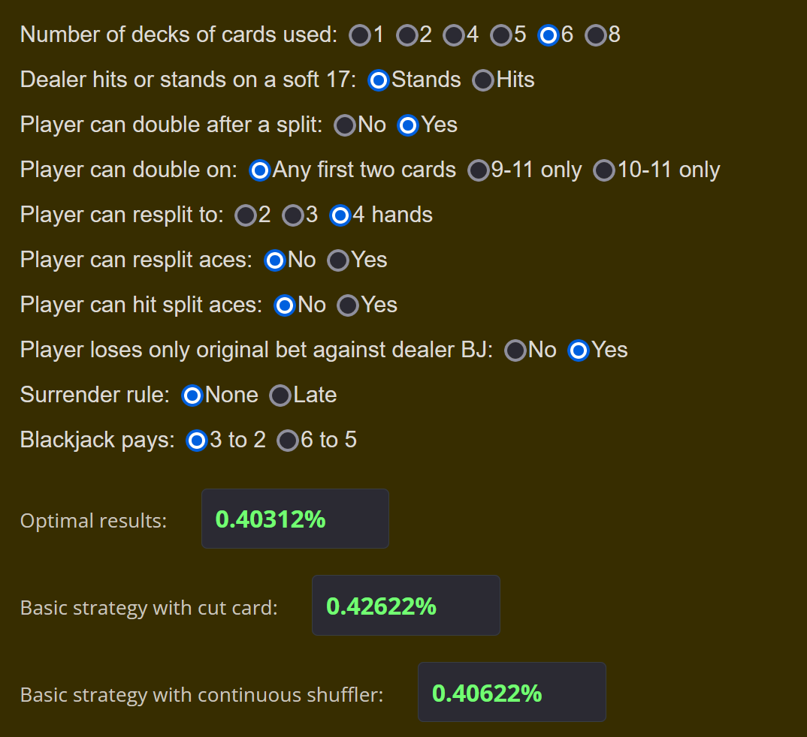
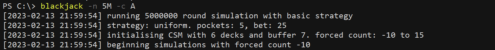

# blackjack

Scripts to help with formulating a card counting strategy for Blackjack.<br>
* blackjack.py--Run simulations of the game
* stratfind.py--Find a betting strategy with positive expected value, if one exists

<hr />

## Summary

It is well-known that Blackjack can be beaten with card counting. It is also thought that continuous shuffling machines make card counting obsolete by making forthcoming cards less predictable. However, it turns out that CSMs have a mechanical feature that allows for some (albeit limited) degree of card counting. This collection of scripts will help us to determine whether the allowed extent of card counting can be exploited to give the player a positive edge over the house. To test the long term results of various cardplay strategies, blackjack.py simulates Blackjack games at a rate of about 6 million rounds per hour. Given the performance of a cardplay strategy, stratfind.py performs an exhaustive search to find a betting strategy that gives the player a positive edge, if one exists. Using these scripts, we found an overall strategy with an edge of ???% in favour of the player.

<hr />

## Usage

Run blackjack.py with the -h option to see the available options.



<hr />

## Simulation

In its default setting, blackjack.py simulates a single round of Blackjack according to the rules [here](https://www.cra.gov.sg/docs/default-source/game-rule-documents/mbs-blackjack-v6.pdf). The simulated player opens 5 pockets with bets of $25 on each, and follows basic strategy. For verbose reporting of the decisions made during the simulated round, run

```blackjack -V```



Nothing groundbreaking is happening here. The verbose option just allows you to check my implementation of basic strategy.

<hr />

## Basic strategy

To estimate the house edge over 5 million rounds, run

```blackjack -n 5M```



The results of the simulation come close to known values from [publicly available sources](https://wizardofodds.com/games/blackjack/calculator/).



In what follows, our goal is to formulate a strategy that not only improves (that is, lowers) the house edge, but gives the player a positive edge.

A popular method for beating Blackjack involves _card counting_, in which a player keeps track of cards that are dealt so they can infer that some cards are less likely to be dealt at a later time. Continuous shuffling machines hinder counting by limiting the number of cards in each round that are affected by the count to a small buffer. In its default setting, blackjack.py simulates a CSM containing 6 decks and with a buffer size of 7; these parameters can be overwritten with the -D and -B options.

We will see that with the right strategy, the player may still obtain an edge against a CSM. Our strategy comprises two parts: a cardplay strategy and a betting strategy.

## Baseline
We consider the cardplay strategy first. Without counting in view, it can be taken for granted that basic strategy is optimum. We'll also consider the profitability of deviations from basic strategy when counts are considered. Before considering deviations, we first establish a baseline by estimating the house edge at each count, and for each possible number of pockets between 1 and 5, under basic strategy. The following command runs, for each of the 26 possible count values from -10 to +15, a simulation of 5M rounds with 1 pocket each, resetting the deck to the target count value after each round:

```blackjack -n 5M -p 1 -c A```



The results are as follows

|Count|1 pocket|2 pockets|3 pockets|4 pockets|5 pockets|
|---|---|---|---|---|---|
|-10|0.008940668725228869|0.008060498158955359|||0.004945398695516308|
|-9|0.008248761787154614|0.0075678120531452306||||
|-8|0.006519810075717198|0.0072578483622067575||||
|-7|0.006216943548658794|0.007134476813796982||||
|-6|0.004421561641010196|||||
|-5|0.0051815451425469535|||||
|-4|0.0039465737514518|||||
|-3|0.0025710564478636155|||||
|-2|0.002031661088540082|||||
|-1|0.0011725632208720016|0.0025747599889965377|||0.003531767357204792|
|0|0.0007503436572156897|0.0022839682276973184||||
|1|-0.0018680833862761178|0.0015679191477510897||||
|2|-0.0015362795421797176|0.00013290102424005166||||
|3|-0.0021047235118650935||||0.00300819823727895|
|4|-0.0025560282249800998|||||
|5|-0.004027763909616168|||||
|6|-0.004394573000260474|||||
|7|-0.0058235973110688614|||||
|8|-0.006778641924954072|-0.00213920002581661||||
|9|-0.00759413918779642|-0.003036382932112425||||
|10|-0.008343678850129651|-0.0028242902771010805||||
|11|-0.008549077529171351|-0.004339783934296084||||
|12|-0.010368139824911554|||||
|13|-0.0099832763366042|||||
|14|-0.011811942849545513|||||
|15|-0.011899512332873544||-0.0056238337371237665|||


## Deviations
We'll test the possible profitabily of the following deviations from basic strategy
- split: 10s against 2-9, 10s against 2, 10s against 9, 9s against 7, As against A
- double on: hard 10/11 against 10, hard 9 against 2-9, hard 12 against 2-9, soft 17/18 against 2, soft 17/18 against 7, soft 13/14 against 4, soft 13/14 against 7, soft 19 against 3-6
- surrender on: hard 13 against 10, hard 14/15 against 9, hard 16 against 8, hard 17 against 9/10
- don't split: As against 10, 8s against 9
- don't surrender on hard 14

